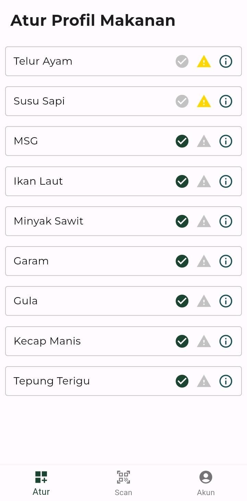

# NutriScope


Solusi digital informasi gizi dan alergen

Made as submission to Hackfest 2024

by pinjam seratus' hackers
- Keanu Fortuna Taufan
- Fadhl Akmal Madany

and our fellows:
- Taib Izzat Samawi (Hipser)
- Wildan Fauzy Maulana Hasyim (Hustler)

One may have gotten themselves in a situation where they want to avoid certain 
ingredients in their foods and drinks. Suppose they were sick, and then advised to avoid
certain ingredients which makes them heal faster, or when they are on a certain diet,
and they want to avoid or limit sugar. There are also people who are vegan, vegetarian, 
pescatarian, and many others, either for health, moral, or religious reasons. Don’t forget 
that some people are allergic to certain types of ingredients, like sea food, milk, and 
gluten, for example.

When one cooks food for themselves, it’s rather simple: just don’t use the 
ingredients which they don’t want to consume. With packaged foods and drinks sold at 
supermarkets, however, is a little different. They would need to check it manually its 
ingredients list to see if it contains something that they need to avoid. Some 
manufacturers are considerate enough to print common allergens with bold font, but 
even then, these lists are very small and hard to read, never mind accessible. There is 
also a very good chance that they would need to do this multiple times.

NutriScope serves as our proposed solution for this problem. It is an app
that scans product metadata (for this time, we are experimenting with BPOM QR Code)
and returns product information along with its ingredients and possible allergens.
User can create lists of ingredients they want to avoid and these lists can always
be modified later on. The next time the user scans product metadata, our app will
warn the user that the said product cointains certain ingredients they marked
to avoid should there be any.


## How to Use

This will be the screen you see the first time you open the app:


We are planning to support Login and Register by email, guest login, and several
auth providers. For now, though, only Login by email is implemented.


Navigate to the login screen and use the following test credential:
```
Email       : test@nutriscope.com
Password    : testuser
```

We have three app screens:


To scan product, point the QR code scanner to the product's BPOM QR.
As for now, we have yet to do comprehensive data collection, so the
lists of product in our database is small, Indomie Mie Instan Goreng
being one of that. Should you need to test this feature, kindly
use the following QR code:


NutriScope will return details of the product, including image, brief
description, and list of its ingredients. NutriScope will also highlight
certain ingredients that the user has marked to avoid, but this feature
is scheduled to be available on the next release. Please look forward to it!


The user can also see lists of ingredients that we indexed. The user can also
mark any ingredients to avoid by clicking the warning icon and unmark it by
clicking the checkmark button. 



This feature, too, is scheduled for the next release. What's available for now,
though, is ingredient details information. Just click at the rightmost icon
of the list item, and a new dialog will appear:


For now, the account screen is a bit boring. There's a little card showing
brief account information and logout button. But hey, expect something 
more on the next release!


## What's next?

We're planning on implementing these features somewhere down the line:
- Mark/unmark ingredient to avoid
- Show whether a certain product contains any ingredient that user has 
  specifically marked to avoid
- Better UI overall
- More auth providers
- Ingredient fuzzy search (Elastic-Firebase integration on free tier when???)
- Firebase storage integration for product images
- Caching
- More things idk

BPOM please notice us ;)